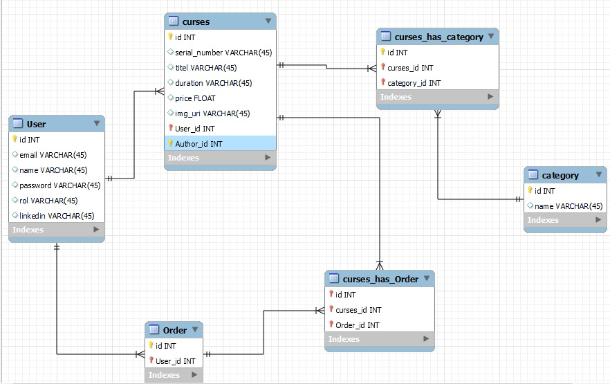

# Ecommerce Database : 
This is a simple database for an ecommerce developed with Node.js:
## Geting Started 🚀
- Clone this repository `https://github.com/TheBouns/ecommercev2.git`
- Install the dependencies `npm install`
- Create a new repo on GitHub: `https://github.com/new`
    - Make sure the "Initialize this repository with a README" option is left unchecked
- Update the remote to point to your GitHub repository: git remote set-url origin `https://github.com/YOUR_GITHUB_USERNAME/YOUR_REPOSITORY_NAME`

## Working on the project 👷‍♂️
* Move into the project directory: `cd ~/YOUR_PROJECTS_DIRECTORY/YOUR_PROJECT_NAME`
* Run the project with : `npm run dev`
    * Server runs at [https://localhost:4000](https://localhost:4000) (by default).
    * Automatically restarts when any of your files change

## Databases

By default the template is configured to connect to a MySql database.
The database has 4  tables : categories, orders,curses and users.


## Starting with the project🌟🌟

First set the configuration to your database:
```js
"development": {
      "username": "root",
      "password": "your password",
      "database": "your db name",
      "host": "127.0.0.1",
      "dialect": "your language"
    },
```
By default an Admin user is created ("admin") to start creating and making changes   to the data base.
To add this admin to the database run the follow command: `sequelize db:seed:all`.

Then migrate the tables to your DB: `sequelize db:migrate`.

**LAST STEP ENJOY**

---------------------------------------------------------------------------------------------------------------

## Basic endpoints

* Get all users in db: `http://localhost:4000/users`
* Get all orders in db: `http://localhost:4000/orders` 
* Get all curses in db: `http://localhost:4000/curses`
* Get all categories in db: `http://localhost:4000/categories`

--------------------------------------------------------------------

## Build with 🛠
- **JavaScript**
- **Node.js**
- **Express**
- **Nodemon**
- **MySql**
- **DotEnv**/**Multer**/**Sequelize**
- **Nodemailer** / **jsonwebtoken**
- **Postman/Insomnia**
--------------------------------------------------------------------
## License
[MIT](https://choosealicense.com/licenses/mit/)